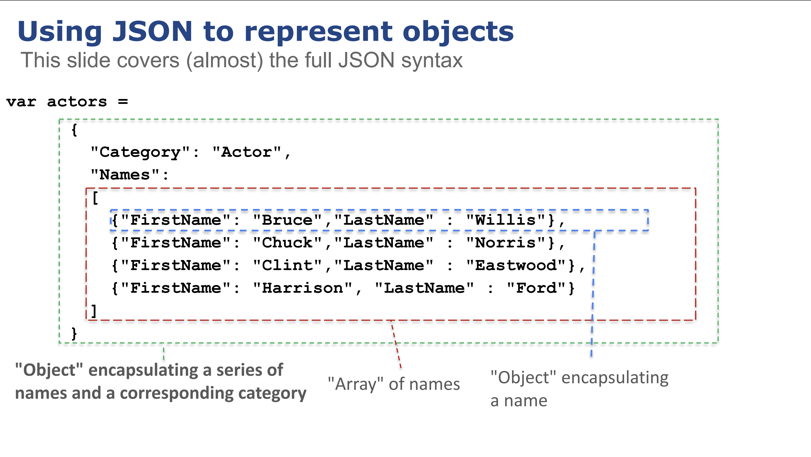
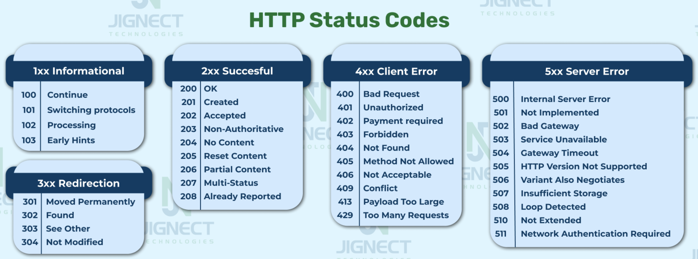

# En introduktion til REST API

## Læringsmål

Når denne dag er slut, bør du kunne svare på disse spørgsmål:

- Hvad er fordelene ved at bruge et RESTful API?
- Hvad er ideen bag de følgende arkitektoniske begrænsninger, der anvendes af REST
    - Uniform Interface
    - Stateless
    - Cacheable
    - Client-Server
    - Layered System
- Hvad er JSON, hvilken struktur har den, og hvorfor passer JSON så godt sammen med REST
- Hvordan bruger man Postman til at teste en RESTful API?
- Hvordan bruger man dokumentationen til et API
- Hvordan og hvorfor skal jeg bruge API keys til authendication
- Hvorfor er Http statuskoder vigtige i forhold til REST API 

## Forberedelse

* Åben Chat-GPT og Copy / Paste spørgsmålene fra læringsmålene ovenover ind og læs svarene den kommer med (30 min)
* Hvis du ikke allerede har Postman på din computer, skal du installere det før vi mødes i klassen (Der er ikke behov for at oprette en konto) (5 min)
* [What is a rest API (9 min)](https://www.youtube.com/embed/lsMQRaeKNDk?si=xwFAOLe-FyhxMnI5)
* [Introduction to REST (22 min)](https://www.youtube.com/watch?v=fqX4BpIWu4s)
* [Architectural Constraints used by Rest (17 min)](https://www.youtube.com/watch?v=u7HWkKhIYbU)
    * (5:50) Lars snakker om localhost:8080/api/players. Det kommer vi ikke dirrekte til at arbejde med dette semester, men i stedet med microservices.(mere om det senere)

## Dagens indhold

Vi starter dagen med en kort gennemgang i overskrifter af hvad i forventes at have lært derhjemme. 

Herefter arbejder vi med følgende emner:

* [Http protokollen](materialer/http.md) 

---

---

--- 

---
* Herefter laver vi en kort gennemgang af hvordan man kan bruge Postman.

Resten af dagen bliver med Ping/pong øvelser/gennemgang ved tavlen.
 
* Vi starter med: Tutorial: [Github API](https://clbo.notion.site/Tutorial-Github-API-153c69a0fc1b4d81880f21ba8626e6a4)
* Se (og skriv) disse tutorial: [Interacting With REST APIs and Python](https://realpython.com/courses/interacting-rest-apis-python/)
    * I skal kun se den gratis del af videoerne (1-5)

* Herefter skal i lave: Øvelse: TheCatApi 
* Så: Øvelse: Simple Tool Rental API
* Og: Øvelser i læringsmålene

