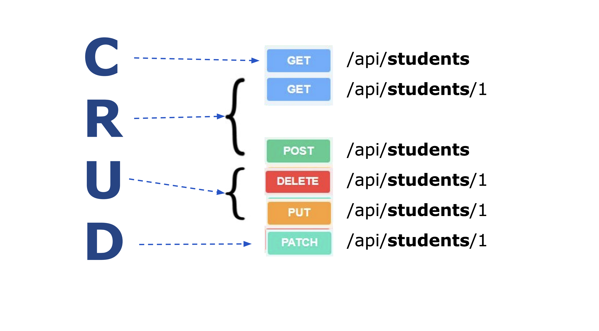

# Flask API
I skal i dag lære at bruge det python web framework der hedder Flask. Og i skal kunne arbejde med en Sqlite database.
 
## Læringsmål
* Kunne oprette et rest API lavet med Flask
* Kunne arbejde med en SqlLite database
* Kunne inkludere api kald til eksterne api´er i en Flask applikation.

## Forberedelse
* [Create A Python API in 12 Minutes](https://www.youtube.com/watch?v=zsYIw6RXjfM) (12:03)
* [SQLite in Python || Python Tutorial || Learn Python Programming](https://www.youtube.com/watch?v=c8yHTlrs9EA)(10:10)

<!--
* [Python SQLite Tutorial: Build a Python project with a SQLite database](https://youtu.be/iXYeb2artTE?feature=shared&t=774)(23:00)
-->

Skim følgende dokumentation for Flask og SqLite

* [Flask Documentation](https://flask.palletsprojects.com/en/3.0.x/) 
    * obs: vi kommer ikke til at arbejde med html filer i dette semester.
* [sqlite3 — DB-API 2.0 interface for SQLite databases](https://docs.python.org/3/library/sqlite3.html)

Og evt denne:

* [SQLite Tutorial](https://www.w3resource.com/sqlite/)


## Dagens indhold


## Materialer


## Øvelser
Kig på følgende diagram og opret et API der følger disse routes.



1. Api´et skal gemme sit data i en Sqlite database. 
2. Hver studerende skal have følgende attributter:

``` 
    id, 
    first_name, 
    last_name, 
    birth_date, 
    gender, 
    email, 
    phonenumber, 
    address, 
    github_username
``` 

3. Man skal kunne se den enkelte studerendes public github repositories som en del af json schemaet i feks. `api/students` routen. 
4. Hvis den studerende der vises er DIG, skal man også kunne se de private repositories.

