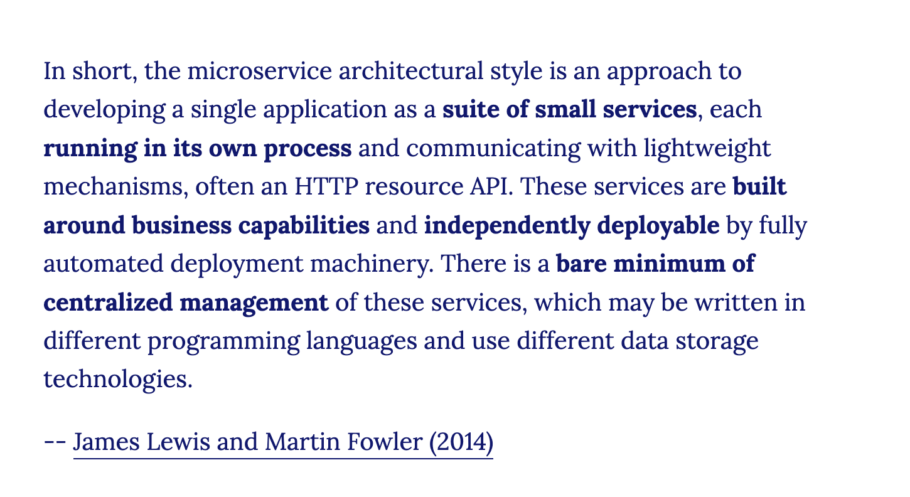

# Microservices 1

## Forberedels

Se denne video for at få en forståelse for hvad Microservices er:    
* [Video: What are Microservices?](https://www.youtube.com/watch?v=CdBtNQZH8a4) (6:37)

## Læringsmål

## Dagens indhold
* [Use persistent shared storage](https://learn.microsoft.com/en-us/azure/app-service/configure-custom-container?pivots=container-linux&tabs=debian#use-persistent-shared-storage)

## Materialer
Todo: Lav en tutorial og video baseret på denne artikkel, men med Azure som host
* [How To Build and Deploy Microservices With Python](https://kinsta.com/blog/python-microservices/)

## flask-change-microservice

* [Building a Realistic Microservice Step-By-Step with Flask](https://www.youtube.com/watch?v=QauGyIdGiNc)
* [flask-change-microservice](https://github.com/noahgift/flask-change-microservice/tree/main)

* [Video: What are Microservices?](https://www.youtube.com/watch?v=CdBtNQZH8a4) (6:37)
* [Microservices (Martin Fowler)](https://martinfowler.com/articles/microservices.html)

<!-- * [Video: Microservices • Martin Fowler • GOTO 2014](https://www.youtube.com/watch?v=wgdBVIX9ifA)-->

### Øvelser

